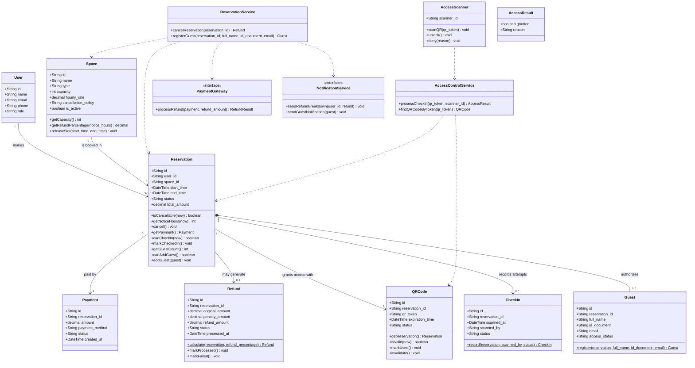
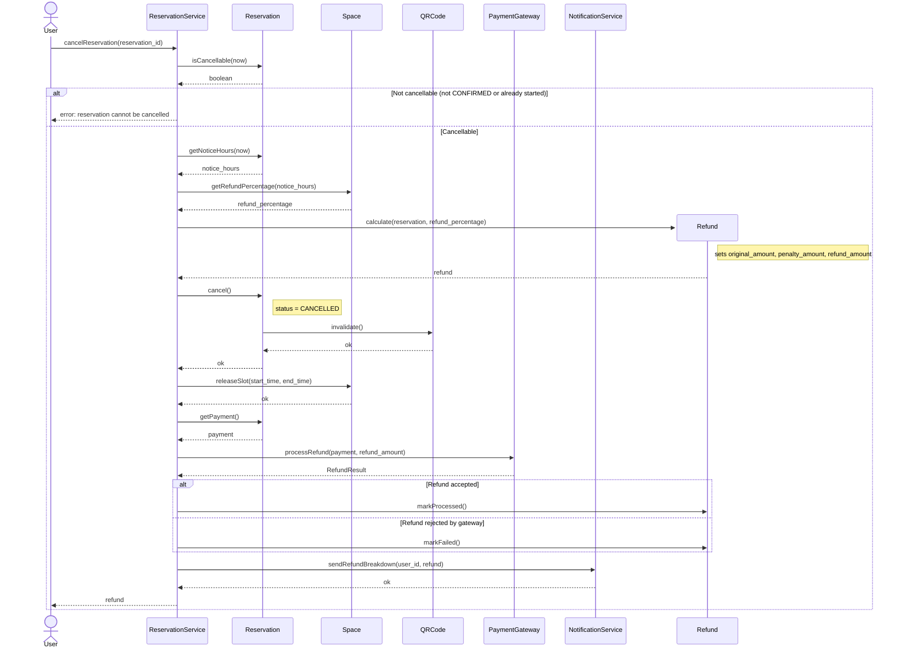
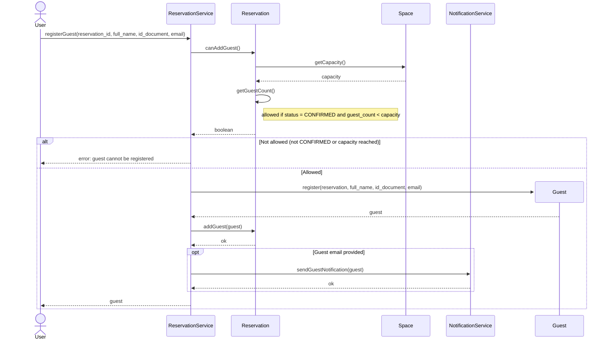

# 2. Sequence Diagrams

Reservation system for additional spaces (UC2, UC3, UC4 from `INFRA.md` / `README.md`).

- **Use case U2:** UC2 – Cancel a reservation with partial refund
- **Use case U3:** UC3 – QR code check-in
- **Use case U4:** UC4 – Register a guest

## 2.0 Reference class diagram (names used by the sequences)

Entities and attributes come from `INFRA.md`. Every method that appears in a sequence diagram is declared here, so names stay consistent across all diagrams. The three `*Service` / `AccessScanner` classes are the only additions: they coordinate the flow so the entities keep their own rules (cancel, validate, add guest).



Two small changes against `INFRA.md` (to be discussed with the team):

1. `Reservation` to `CheckIn` is **1 : 0..\*** instead of 1 : 0..1, because UC3 step 4 logs a `FAILED` check-in for every rejected scan, so one reservation can have several attempts.
2. `Guest` gets an `email` attribute, because UC4 step 2 captures it and step 5 uses it to notify the guest.

---

## 2.1 UC2 – Cancel a reservation with partial refund

**Flow:** the user asks to cancel. The system checks that the reservation can still be cancelled, looks up the refund percentage in the space's cancellation policy, creates the `Refund` (penalty + refund amount), cancels the reservation (which also invalidates its QR), releases the time slot, asks the payment gateway for the partial refund, and finally notifies the user with the breakdown.



**Design decisions**

- The percentage rule lives in `Space` (it owns `cancellation_policy`); `Refund.calculate` only does the arithmetic. If the policy changes, only `Space` changes.
- `Reservation.cancel()` invalidates its own `QRCode`, so a cancelled reservation can never keep a valid pass.
- The reservation is cancelled **before** calling the gateway: the user's intent to cancel is not lost if the gateway fails; the `Refund` is just left as `FAILED` for retry.

---

## 2.2 UC3 – QR code check-in

**Flow:** the user presents the QR at the scanner. The scanner delegates validation to `AccessControlService`, which finds the QR by token, checks the pass itself (status and expiration) and the reservation (status `CONFIRMED` and allowed time window). On success it records a `SUCCESS` `CheckIn`, moves the reservation to `CHECKED_IN`, marks the QR as `USED`, and the scanner unlocks the door. On failure it records a `FAILED` `CheckIn` and the scanner denies access.

```mermaid
sequenceDiagram
    actor User
    participant AccessScanner
    participant AccessControlService
    participant QRCode
    participant Reservation
    participant CheckIn

    User->>AccessScanner: scanQR(qr_token)
    AccessScanner->>AccessControlService: processCheckIn(qr_token, scanner_id)
    AccessControlService->>AccessControlService: findQRCodeByToken(qr_token)

    alt Token not found
        AccessControlService-->>AccessScanner: AccessResult(granted=false, reason=UNKNOWN_TOKEN)
    else Token found
        AccessControlService->>QRCode: getReservation()
        QRCode-->>AccessControlService: reservation
        AccessControlService->>QRCode: isValid(now)
        QRCode-->>AccessControlService: qr_valid
        AccessControlService->>Reservation: canCheckIn(now)
        Reservation-->>AccessControlService: reservation_ok

        alt qr_valid and reservation_ok
            create participant CheckIn
            AccessControlService->>CheckIn: record(reservation, scanner_id, SUCCESS)
            CheckIn-->>AccessControlService: check_in
            AccessControlService->>Reservation: markCheckedIn()
            Note right of Reservation: status = CHECKED_IN
            Reservation-->>AccessControlService: ok
            AccessControlService->>QRCode: markUsed()
            QRCode-->>AccessControlService: ok
            AccessControlService-->>AccessScanner: AccessResult(granted=true)
        else Expired, cancelled or out of schedule
            AccessControlService->>CheckIn: record(reservation, scanner_id, FAILED)
            CheckIn-->>AccessControlService: check_in
            AccessControlService-->>AccessScanner: AccessResult(granted=false, reason)
        end
    end

    alt granted
        AccessScanner->>AccessScanner: unlock()
        AccessScanner-->>User: access granted
    else denied
        AccessScanner->>AccessScanner: deny(reason)
        AccessScanner-->>User: access denied
    end
```

**Design decisions**

- `AccessScanner` only handles the hardware (read, unlock, deny); all business rules stay in `AccessControlService`, `QRCode` and `Reservation`.
- Two separate checks: `QRCode.isValid` asks "is this pass good?", `Reservation.canCheckIn` asks "is this the right moment?". Each object answers about its own data.
- An unknown token creates **no** `CheckIn`, because `CheckIn` requires a `reservation_id` and an unknown token has none. The denial is only returned to the scanner.

---

## 2.3 UC4 – Register a guest

**Flow:** the holder submits the guest data for an active reservation. The system checks that the reservation is `CONFIRMED` and still has capacity. If so, it creates the `Guest`, links it to the reservation and optionally notifies the guest.



**Design decisions**

- `Reservation.canAddGuest()` owns the rule (status + capacity); the service does not read `Space` attributes directly, so the rule has a single home.
- The notification is `opt`: the guest pass is an optional step in UC4 and must not block the registration.

---

## 2.4 Consistency check

| Message in sequences | Declared in class diagram |
|---|---|
| `cancelReservation`, `registerGuest` | `ReservationService` |
| `isCancellable`, `getNoticeHours`, `cancel`, `getPayment`, `canCheckIn`, `markCheckedIn`, `canAddGuest`, `getGuestCount`, `addGuest` | `Reservation` |
| `getRefundPercentage`, `releaseSlot`, `getCapacity` | `Space` |
| `calculate`, `markProcessed`, `markFailed` | `Refund` |
| `invalidate`, `isValid`, `markUsed`, `getReservation` | `QRCode` |
| `record` | `CheckIn` |
| `register` | `Guest` |
| `processCheckIn`, `findQRCodeByToken` | `AccessControlService` |
| `scanQR`, `unlock`, `deny` | `AccessScanner` |
| `processRefund` | `PaymentGateway` |
| `sendRefundBreakdown`, `sendGuestNotification` | `NotificationService` |
